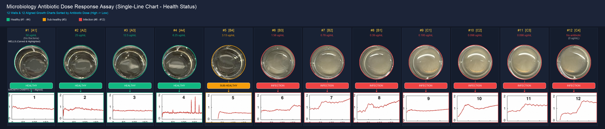
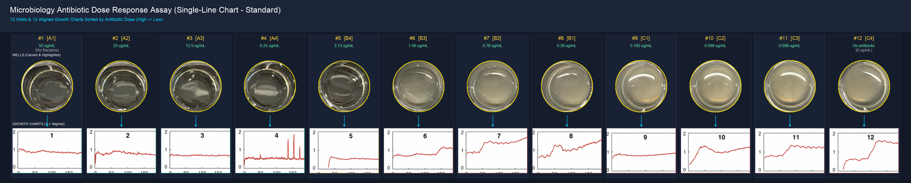
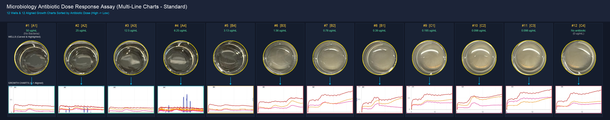

# Microplate Well Extraction & Growth Curve Dose-Response Alignment


An automated image processing and analysis pipeline for microbiology dose-response assays, supporting both multi-line and single-line growth curve datasets, standard aligned layouts, and health transition state classification.

This repository processes 12-well microplate photos (`12-wells.jpeg`), multi-curve growth plots (`12-charts.jpeg`), high-res single-curve growth plots (`12-chart-single.png`), and maps them 1-to-1 against concentration layout mapping (`12-layout.png`).

---

## 💬 Prompts

> **Original Prompt**:
> "I have 3 pictures (12 wells , 12 charts, 12 layout). 1. For the 12 wells, please highlight each well and carve out as an image (totally 12).  2. For the 12 charts, split into 12 individual charts. 3. Now create a new image, line the 12 carved-out wells in a row, and line the 12 charts in a row, below the wells (1 chart aligns with 1 well).   Keep in mind, the locations of wells and charts in original pictures have 1-1 mapping, and when making them in a row, I want to sort (high => low) by the antibiotic doses info in the 12-layout picture."
>
> **Enhancement Prompt (Color-Bars)**:
> "Great! I want to enhance the final image to indicate the transition from healthy (#1 ~ #4, with green color), sub-healthy (#5, yellow color), infection (the rest, red color). insert a color-bar in-between each well-image and chart-image"
>
> **New Dataset Prompt**:
> "I added a new 12-chart-single, would like to see the effect of using it to replace the earlier 12-charts. Please analyze the chart image to remove the X/Y ledgend, for more precise splitting"

---

## 📸 Output Visualizations (All Versions Retained)

### 1. Single-Line Growth Curves (`12-chart-single.png`)

#### Version 2: Health Transition Color-Bars (Enhanced)
File: `sorted_wells_and_singlechart_v2_colorbars.png`


#### Version 1: Standard Clean Alignment
File: `sorted_wells_and_singlechart_v1_clean.png`


---

### 2. Multi-Line Growth Curves (`12-charts.jpeg`)

#### Version 2: Health Transition Color-Bars (Enhanced)
File: `sorted_wells_and_multicharts_v2_colorbars.png`


#### Version 1: Standard Clean Alignment
File: `sorted_wells_and_multicharts_v1_clean.png`


---

## ✨ Summary of Available Versions

| Version File | Chart Dataset Used | Layout Style | Color Bars |
| :--- | :--- | :---: | :---: |
| [`sorted_wells_and_singlechart_v2_colorbars.png`](sorted_wells_and_singlechart_v2_colorbars.png) | `12-chart-single.png` (High-Res) | Health Transition | 🟢 🟡 🔴 |
| [`sorted_wells_and_singlechart_v1_clean.png`](sorted_wells_and_singlechart_v1_clean.png) | `12-chart-single.png` (High-Res) | Standard Clean | Cyan Accents |
| [`sorted_wells_and_multicharts_v2_colorbars.png`](sorted_wells_and_multicharts_v2_colorbars.png) | `12-charts.jpeg` (Multi-line) | Health Transition | 🟢 🟡 🔴 |
| [`sorted_wells_and_multicharts_v1_clean.png`](sorted_wells_and_multicharts_v1_clean.png) | `12-charts.jpeg` (Multi-line) | Standard Clean | Cyan Accents |

---

## 📊 Health Transition & Concentration Mapping

| Rank | Well ID | Antibiotic Concentration | Health Status | Color Code | Notes |
| :---: | :---: | :---: | :---: | :---: | :--- |
| **#1** | **A1** | 50 µg/mL | **Healthy** | 🟢 Green | No Bacteria (Control) |
| **#2** | **A2** | 25 µg/mL | **Healthy** | 🟢 Green | High Dose |
| **#3** | **A3** | 12.5 µg/mL | **Healthy** | 🟢 Green | High Dose |
| **#4** | **A4** | 6.25 µg/mL | **Healthy** | 🟢 Green | Medium-High Dose |
| **#5** | **B4** | 3.13 µg/mL | **Sub-Healthy** | 🟡 Yellow | Transition Zone |
| **#6** | **B3** | 1.56 µg/mL | **Infection** | 🔴 Red | Bacterial Growth |
| **#7** | **B2** | 0.78 µg/mL | **Infection** | 🔴 Red | Bacterial Growth |
| **#8** | **B1** | 0.39 µg/mL | **Infection** | 🔴 Red | Bacterial Growth |
| **#9** | **C1** | 0.195 µg/mL | **Infection** | 🔴 Red | Bacterial Growth |
| **#10** | **C2** | 0.098 µg/mL | **Infection** | 🔴 Red | Bacterial Growth |
| **#11** | **C3** | 0.098 µg/mL | **Infection** | 🔴 Red | Bacterial Growth |
| **#12** | **C4** | No antibiotic (0 µg/mL) | **Infection** | 🔴 Red | Growth Control |

---

## 📁 Repository Structure

```
MicroBiology/
├── process_microbiology.py                   # Automation pipeline generating all composite versions
├── 12-wells.jpeg                             # Raw 12-well microplate photo
├── 12-charts.jpeg                            # Raw multi-line growth curve plots
├── 12-chart-single.png                       # High-res single-line growth curve plots
├── 12-layout.png                             # Raw layout diagram
├── carved_wells/                             # 12 circular RGBA carved well images
├── split_charts_multi/                       # 12 split multi-line chart images
├── split_charts_single/                      # 12 split single-line chart images (legend removed)
├── sorted_wells_and_singlechart_v2_colorbars.png
├── sorted_wells_and_singlechart_v1_clean.png
├── sorted_wells_and_multicharts_v2_colorbars.png
└── sorted_wells_and_multicharts_v1_clean.png
```

---

## 🚀 Quick Start

```bash
python process_microbiology.py
```
Running `process_microbiology.py` automatically generates all composite image versions and populates both split chart directories.
