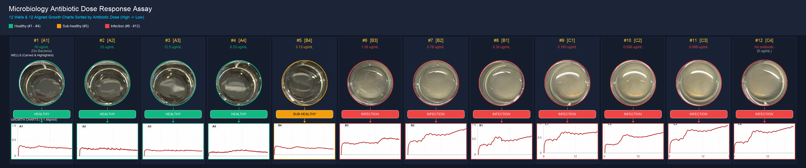

# Microplate Well Extraction & Growth Curve Dose-Response Alignment


An automated image processing and analysis pipeline for microbiology dose-response assays.

This repository processes 12-well microplate photos (`12-wells.jpeg`), splits multi-panel growth curves (`12-charts-v2.jpg`), correlates them 1-to-1 with experimental layout concentration annotations (`12-layout.png`), and outputs a high-to-low antibiotic concentration sorted visualization featuring in-between health transition color bars.

---

## 📸 Output Preview



---

## ✨ Key Features

1. **In-Between Health Status Color-Bars**:
   - Inserts color-coded status indicator bars directly between each carved well image and its aligned growth chart.
   - 🟩 **Healthy** (#1–#4): Green (`#10B981`)
   - 🟨 **Sub-Healthy** (#5): Yellow (`#F59E0B`)
   - 🟥 **Infection** (#6–#12): Red (`#EF4444`)
2. **Well Extraction & Highlighting**:
   - Automatically detects and crops all 12 microplate wells into transparent RGBA circular images with accent highlights matching each health state.
3. **Growth Curve Splitting**:
   - Crops each individual growth plot from the 3x4 panel grid with matching status borders.
4. **Antibiotic Dose Sorting (High → Low)**:
   - Maps each position (A1..C4) to its corresponding antibiotic concentration (50 µg/mL down to 0 µg/mL).
   - Rearranges all 12 wells and charts into a single high-to-low concentration row layout.
5. **1-to-1 Vertical Alignment**:
   - Positions each growth curve chart directly beneath its corresponding microplate well for intuitive visual comparison.

---

## 📊 Concentration & Health Mapping

| Rank | Well ID | Antibiotic Concentration | Health Status | Color Code | Notes |
| :---: | :---: | :---: | :---: | :---: | :--- |
| **#1** | **A1** | 50 µg/mL | **Healthy** | 🟢 Green | No Bacteria (Control) |
| **#2** | **A2** | 25 µg/mL | **Healthy** | 🟢 Green | High Dose |
| **#3** | **A3** | 12.5 µg/mL | **Healthy** | 🟢 Green | High Dose |
| **#4** | **A4** | 6.25 µg/mL | **Healthy** | 🟢 Green | Medium-High Dose |
| **#5** | **B4** | 3.13 µg/mL | **Sub-Healthy** | 🟡 Yellow | Transition Zone |
| **#6** | **B3** | 1.56 µg/mL | **Infection** | 🔴 Red | Bacterial Growth |
| **#7** | **B2** | 0.78 µg/mL | **Infection** | 🔴 Red | Bacterial Growth |
| **#8** | **B1** | 0.39 µg/mL | **Infection** | 🔴 Red | Bacterial Growth |
| **#9** | **C1** | 0.195 µg/mL | **Infection** | 🔴 Red | Bacterial Growth |
| **#10** | **C2** | 0.098 µg/mL | **Infection** | 🔴 Red | Bacterial Growth |
| **#11** | **C3** | 0.098 µg/mL | **Infection** | 🔴 Red | Bacterial Growth |
| **#12** | **C4** | No antibiotic (0 µg/mL) | **Infection** | 🔴 Red | Growth Control |

---

## 📁 Repository Structure

```
MicroBiology/
├── process_microbiology.py          # Main processing script for the latest version
├── 12-wells.jpeg                    # Source 12-well plate photo
├── 12-charts-v2.jpg                 # Source 12-chart photo (latest)
├── 12-layout.png                    # Source layout diagram
├── carved_wells/                    # 12 circular RGBA carved well images
├── split_charts/                    # 12 split chart images (from 12-charts-v2.jpg)
├── sorted_wells_and_charts_row.png  # Final aligned row composite image
└── README.md                        # Project documentation
```

---

## 🚀 Quick Start

### 1. Install Dependencies
```bash
pip install opencv-python pillow numpy
```

### 2. Run Processing Pipeline
```bash
python process_microbiology.py
```

All extracted images will be generated in `carved_wells/`, `split_charts/`, and the combined composite image will be saved as `sorted_wells_and_charts_row.png`.
