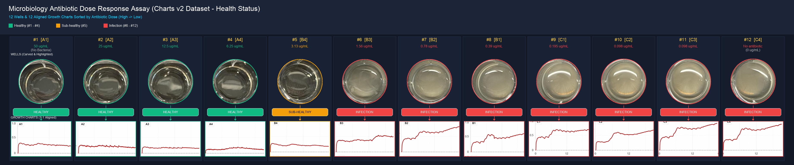
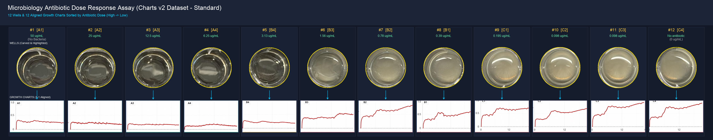

# Microplate Well Extraction & Growth Curve Dose-Response Alignment


An automated image processing and analysis pipeline for microbiology dose-response assays, supporting multiple growth curve datasets (`12-charts-v2.jpg`, `12-chart-single.png`, `12-charts.jpeg`), standard aligned layouts, and health transition state classification.

---

## 💬 Prompts

> **Original Prompt**:
> "I have 3 pictures (12 wells , 12 charts, 12 layout). 1. For the 12 wells, please highlight each well and carve out as an image (totally 12).  2. For the 12 charts, split into 12 individual charts. 3. Now create a new image, line the 12 carved-out wells in a row, and line the 12 charts in a row, below the wells (1 chart aligns with 1 well).   Keep in mind, the locations of wells and charts in original pictures have 1-1 mapping, and when making them in a row, I want to sort (high => low) by the antibiotic doses info in the 12-layout picture."
>
> **Color-Bars Prompt**:
> "Great! I want to enhance the final image to indicate the transition from healthy (#1 ~ #4, with green color), sub-healthy (#5, yellow color), infection (the rest, red color). insert a color-bar in-between each well-image and chart-image"
>
> **Charts-V2 Prompt**:
> "try 12-charts-v2"

---

## 📸 Output Visualizations (All Datasets Retained)

### 1. `12-charts-v2.jpg` Dataset (Single Red Curves with Panel Labels)

#### Version 2: Health Transition Color-Bars (Enhanced)
File: `sorted_wells_and_chartsv2_v2_colorbars.png`


#### Version 1: Standard Clean Alignment
File: `sorted_wells_and_chartsv2_v1_clean.png`


---

### 2. `12-chart-single.png` Dataset (High-Res Single Curves)

#### Version 2: Health Transition Color-Bars (Enhanced)
File: `sorted_wells_and_singlechart_v2_colorbars.png`


#### Version 1: Standard Clean Alignment
File: `sorted_wells_and_singlechart_v1_clean.png`


---

### 3. `12-charts.jpeg` Dataset (Original Multi-Line Curves)

#### Version 2: Health Transition Color-Bars (Enhanced)
File: `sorted_wells_and_multicharts_v2_colorbars.png`


#### Version 1: Standard Clean Alignment
File: `sorted_wells_and_multicharts_v1_clean.png`


---

## ✨ Summary of Output Assets

| Composite File | Input Chart Dataset | Layout Style | Color Bars |
| :--- | :--- | :---: | :---: |
| [`sorted_wells_and_chartsv2_v2_colorbars.png`](sorted_wells_and_chartsv2_v2_colorbars.png) | `12-charts-v2.jpg` | Health Transition | 🟢 🟡 🔴 |
| [`sorted_wells_and_chartsv2_v1_clean.png`](sorted_wells_and_chartsv2_v1_clean.png) | `12-charts-v2.jpg` | Standard Clean | Cyan Accents |
| [`sorted_wells_and_singlechart_v2_colorbars.png`](sorted_wells_and_singlechart_v2_colorbars.png) | `12-chart-single.png` | Health Transition | 🟢 🟡 🔴 |
| [`sorted_wells_and_singlechart_v1_clean.png`](sorted_wells_and_singlechart_v1_clean.png) | `12-chart-single.png` | Standard Clean | Cyan Accents |
| [`sorted_wells_and_multicharts_v2_colorbars.png`](sorted_wells_and_multicharts_v2_colorbars.png) | `12-charts.jpeg` | Health Transition | 🟢 🟡 🔴 |
| [`sorted_wells_and_multicharts_v1_clean.png`](sorted_wells_and_multicharts_v1_clean.png) | `12-charts.jpeg` | Standard Clean | Cyan Accents |

---

## 📁 Repository Structure

```
MicroBiology/
├── process_microbiology.py                 # Pipeline generating all composite versions across all 3 datasets
├── 12-wells.jpeg                           # Raw 12-well microplate photo
├── 12-charts-v2.jpg                        # 12-charts-v2 single red curve dataset
├── 12-chart-single.png                     # High-res single-line curve dataset
├── 12-charts.jpeg                          # Original multi-line curve dataset
├── 12-layout.png                           # Raw layout diagram
├── carved_wells/                           # 12 circular RGBA carved well images
├── split_charts_v2/                        # 12 split chart images from 12-charts-v2.jpg
├── split_charts_single/                    # 12 split chart images from 12-chart-single.png
├── split_charts_multi/                     # 12 split chart images from 12-charts.jpeg
├── sorted_wells_and_chartsv2_v2_colorbars.png
├── sorted_wells_and_chartsv2_v1_clean.png
├── sorted_wells_and_singlechart_v2_colorbars.png
├── sorted_wells_and_singlechart_v1_clean.png
├── sorted_wells_and_multicharts_v2_colorbars.png
└── sorted_wells_and_multicharts_v1_clean.png
```
